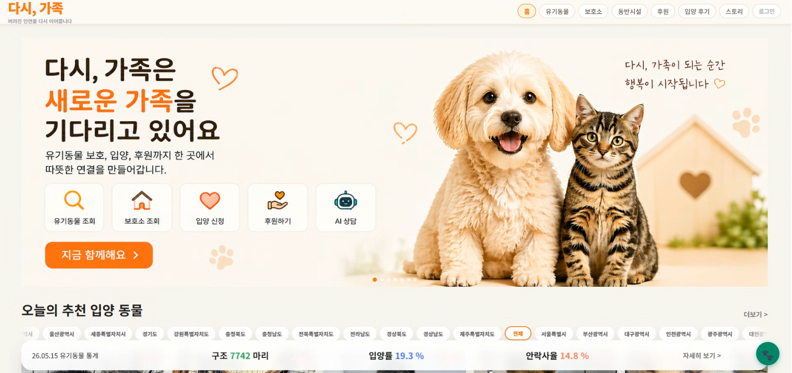
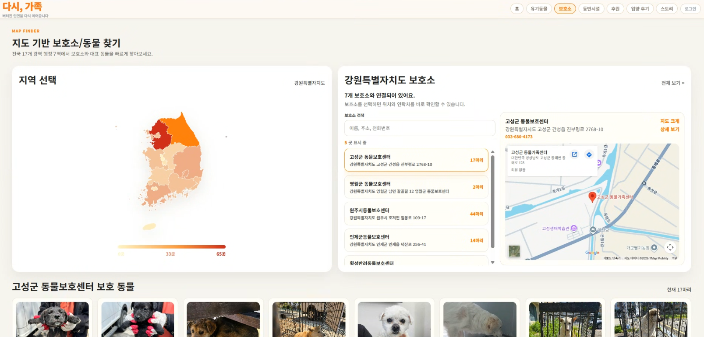
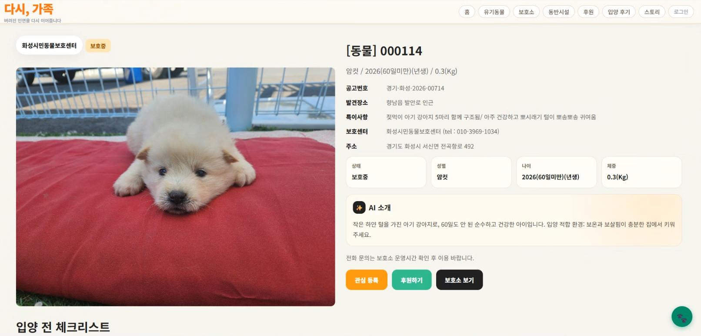

<div align="center">

# 다시, 가족

### 유기동물 조회부터 입양 신청, 후원, AI 상담, 관리자 운영까지 연결한 풀스택 동물 입양 플랫폼


<br />



</div>

## Portfolio Point

`다시, 가족`은 공공데이터포털의 유기동물 데이터를 수집해 사용자 서비스와 관리자 운영 기능까지 이어지도록 만든 포트폴리오 프로젝트입니다. 단순 CRUD를 넘어서 배치 수집, 세션 인증, CSRF, 관리자 권한, 이미지 업로드 검증, 결제 준비/검증 구조, AI 소개/상담, 통계 화면까지 실제 서비스 운영 흐름을 기준으로 구성했습니다.

| 영역 | 구현 포인트 |
| --- | --- |
| 데이터 수집 | 공공 API 데이터를 배치로 수집하고 `AnimalSnapshot`에 저장 |
| 사용자 경험 | 지역별 동물 조회, 보호소 지도 탐색, 관심 동물, 입양 신청, 후기 |
| 인증/보안 | 세션 로그인, OAuth2 확장 구조, CSRF 토큰, 관리자 권한 분리 |
| 결제/후원 | PortOne 결제 준비/검증 구조, 후원 캠페인, 후원자 등급 |
| 운영 도구 | 관리자 대시보드, 신청/후원/회원/캠페인/배치 관리 |
| AI 기능 | OpenRouter 기반 동물 소개글 생성, 입양 상담 챗봇 |

## Preview

| 메인 | 보호소 지도 탐색 |
| --- | --- |
|  |  |

| 유기 동물 정보 / AI 소개 |
| --- |
|  |

## 빠른 실행

```powershell
# Backend
cd C:\ww\ww\demo
$env:JAVA_HOME='C:\ww\ww\jdk21\jdk-21.0.10+7'
$env:Path="$env:JAVA_HOME\bin;$env:Path"
.\mvnw.cmd spring-boot:run
```

```powershell
# Frontend
cd C:\ww\ww\frontend
npm run dev
```

```text
Frontend: http://localhost:5173
Backend:  http://localhost:8080
Swagger:  http://localhost:8080/swagger-ui/index.html
```

## 목차

- [Portfolio Point](#portfolio-point)
- [Preview](#preview)
- [빠른 실행](#빠른-실행)
- [프로젝트 소개](#프로젝트-소개)
- [핵심 기능](#핵심-기능)
- [기술 스택](#기술-스택)
- [프로젝트 구조](#프로젝트-구조)
- [아키텍처](#아키텍처)
- [다른 컴퓨터에서 실행하기](#다른-컴퓨터에서-실행하기)
- [환경변수](#환경변수)
- [데모 계정](#데모-계정)
- [주요 API](#주요-api)
- [운영/관리 기능](#운영관리-기능)
- [자주 나는 문제 해결](#자주-나는-문제-해결)
- [빌드/검증 명령어](#빌드검증-명령어)

## 프로젝트 소개

**다시, 가족**은 공공데이터포털(data.go.kr)의 유기동물 데이터를 기반으로 보호 중인 동물과 보호소 정보를 제공하고, 사용자가 입양 신청과 후원까지 이어갈 수 있도록 만든 풀스택 웹 서비스입니다.

단순 조회 서비스가 아니라 실제 서비스 운영을 고려해 다음 흐름을 구현했습니다.

1. 공공 API 데이터를 매일 배치로 수집
2. 수집 데이터를 `AnimalSnapshot` DB에 저장
3. 사용자 화면은 DB에서 빠르게 조회
4. 관심 동물, 입양 신청, 후원, 후기 작성까지 연결
5. AI 소개와 챗봇으로 입양 준비 과정 지원
6. 관리자 페이지에서 신청/후원/캠페인/회원/배치 상태 관리

## 핵심 기능

| 구분 | 기능 |
| --- | --- |
| 유기동물 조회 | 동물 목록, 상세 정보, 지역별 추천, 마감임박/오래기다림 추천 배지 |
| AI 소개 | 동물의 품종, 나이, 체중, 성별, 특이사항을 기반으로 자연어 소개 생성 |
| AI 챗봇 | 입양 상담사 포동이, 입양 준비 상담, 빠른 답변 템플릿 제공 |
| 보호소 | 보호소 목록/상세, 보호 동물 수, 보호소별 후원 연결 |
| 입양 신청 | 신청서 작성, 내 신청 목록 조회, 관리자 승인/거절 처리 |
| 관심 동물 | 로그인 사용자별 관심 동물 저장/삭제/조회 |
| 후원 | 보호소 후원, 캠페인 후원, PortOne 결제 준비 구조 |
| 후원 캠페인 | 캠페인 등록/수정/삭제/활성화, 이미지 업로드, 진행률 표시 |
| 후원자 등급 | 누적 후원 금액 기반 새싹/든든한/챔피언/천사 등급 계산 |
| 입양 후기 | 후기 작성, 이미지 업로드, 후기 목록/상세, 좋아요 |
| 통계 | 구조 동물 수, 입양률, 안락사율, 지역별 통계, 히트맵 |
| 관리자 | 대시보드, 입양 신청 관리, 후원 관리, 캠페인 관리, 회원 관리, 배치 히스토리 |
| 배치/운영 | 매일 새벽 2시 데이터 수집, 수동 배치 실행, 배치 로그 저장 |

## 기술 스택

### Backend

- Java 21
- Spring Boot 3.5.6
- Spring MVC
- Spring Data JPA / Hibernate
- Spring Security
- Session 기반 인증
- OAuth2 Client
- Spring Validation
- Spring Scheduler
- Spring Mail
- Spring Cache / Caffeine
- SpringDoc OpenAPI / Swagger UI
- MySQL 8
- H2 Database
- JUnit 5 / MockMvc / Mockito

### Frontend

- React 18
- Vite
- React Router
- JavaScript
- CSS
- Recharts
- react-simple-maps
- React Error Boundary
- React.lazy / Suspense
- Fetch API

### External API / Integration

- 공공데이터포털 data.go.kr API
- OpenRouter AI API
- PortOne 결제 API
- SMTP Mail
- AWS S3 선택 지원
- Local File Storage

### Infra / Config

- Docker
- Docker Compose
- Spring Profile: local, prod
- 환경변수 기반 설정
- `.env`, `.env.example`
- StorageService 전략 패턴: local / s3 전환

## 프로젝트 구조

```text
D:\ww
├─ README.md                    # 루트 실행/소개 문서
├─ .env.example                 # 전체 환경변수 예시
├─ demo                         # Spring Boot 백엔드
│  ├─ pom.xml
│  ├─ mvnw.cmd
│  ├─ docker-compose.yml
│  ├─ Dockerfile
│  └─ src/main/java/com/animalplatform
├─ frontend                     # React + Vite 프론트엔드
│  ├─ package.json
│  ├─ index.html
│  └─ src
│     ├─ pages
│     ├─ components
│     ├─ assets
│     └─ lib/api.js
└─ docs                         # 발표/문서 자료 보관용
```

## 아키텍처

```text
[React + Vite]
      |
      | HTTP / Session Cookie
      v
[Spring Boot API]
      |
      |-- Spring Security / Session Auth / OAuth2
      |-- JPA / MySQL / H2
      |-- Scheduler / Batch Log
      |
      |--> [data.go.kr Public API]
      |        매일 02:00 배치 수집 -> AnimalSnapshot 저장
      |
      |--> [OpenRouter AI]
      |        동물 AI 소개 / 입양 상담 챗봇
      |
      |--> [PortOne]
      |        결제 준비 / 결제 검증 구조
      |
      |--> [Local Storage or AWS S3]
      |        후기/캠페인 이미지 저장
      |
      |--> [SMTP Mail]
               후원자 등급/알림 이메일
```

## 다른 컴퓨터에서 실행하기

### 1. 사전 설치

다른 컴퓨터에는 아래가 필요합니다.

- Java 21
- Node.js 18 이상
- MySQL 8 또는 Docker Desktop
- Git 또는 압축 파일 이동 수단
- 공공데이터포털 API 키
- OpenRouter API 키

### 2. 프로젝트 복사

권장 위치 예시입니다.

```powershell
D:\ww
├─ demo
└─ frontend
```

압축해서 옮길 때는 아래 폴더는 빼도 됩니다.

```text
frontend/node_modules
frontend/dist
demo/target
.m2repo
jdk21
temurin21.zip
```

새 컴퓨터에서 다시 설치/빌드하면 됩니다.

### 3. 루트 `.env` 만들기

루트에 있는 `.env.example`을 복사해서 `.env`를 만듭니다.

```powershell
cd D:\ww
copy .env.example .env
```

그리고 `.env` 안의 값을 실제 값으로 바꿉니다.

최소 실행에 필요한 값은 아래입니다.

```env
DB_URL=jdbc:mysql://localhost:3306/again_family?serverTimezone=Asia/Seoul&characterEncoding=UTF-8&useUnicode=true&allowPublicKeyRetrieval=true&useSSL=false
DB_USERNAME=root
DB_PASSWORD=내_mysql_비밀번호
PUBLIC_API_KEY=공공데이터포털_서비스키
OPENROUTER_API_KEY=OpenRouter_API_KEY
VITE_API_BASE_URL=http://localhost:8080
```

### 4. MySQL DB 생성

Workbench나 터미널에서 DB를 먼저 만듭니다.

```sql
CREATE DATABASE again_family CHARACTER SET utf8mb4 COLLATE utf8mb4_unicode_ci;
```

이미 만들어져 있으면 다시 만들 필요 없습니다.

### 5. 백엔드 실행

```powershell
cd D:\ww\demo
.\mvnw.cmd spring-boot:run "-Dspring-boot.run.profiles=local"
```

정상 실행 주소:

- Backend: http://localhost:8080
- Swagger: http://localhost:8080/swagger-ui.html
- H2 Console: http://localhost:8080/h2-console, H2 사용 시

### 6. 프론트엔드 실행

처음 한 번만 의존성을 설치합니다.

```powershell
cd D:\ww\frontend
npm install
```

개발 서버 실행:

```powershell
npm run dev
```

정상 실행 주소:

- Frontend: http://localhost:5173

### 7. Docker로 MySQL + 백엔드 실행하기

Docker Desktop을 쓸 경우 백엔드 폴더에서 실행합니다.

```powershell
cd D:\ww\demo
docker compose up --build
```

프론트엔드는 별도 터미널에서 실행합니다.

```powershell
cd D:\ww\frontend
npm install
npm run dev
```

## 환경변수

| 변수명 | 설명 | 필수 | 예시 |
| --- | --- | --- | --- |
| `FRONTEND_BASE_URL` | 프론트 주소 | 권장 | `http://localhost:5173` |
| `SERVER_PORT` | 백엔드 포트 | 선택 | `8080` |
| `DB_URL` | MySQL JDBC URL | MySQL 사용 시 필수 | `jdbc:mysql://localhost:3306/again_family...` |
| `DB_USERNAME` | DB 계정 | MySQL 사용 시 필수 | `root` |
| `DB_PASSWORD` | DB 비밀번호 | MySQL 사용 시 필수 | `password` |
| `PUBLIC_API_KEY` | 공공데이터포털 서비스 키 | 권장 | `your_data_go_kr_key` |
| `OPENROUTER_API_KEY` | OpenRouter API 키 | AI 사용 시 필수 | `sk-or-v1-...` |
| `OPENROUTER_MODEL` | 기본 AI 모델 | 선택 | `meta-llama/llama-3.3-70b-instruct:free` |
| `OPENROUTER_FALLBACK_MODELS` | fallback 무료 모델 목록 | 선택 | `nvidia/...,qwen/...` |
| `PORTONE_STORE_ID` | PortOne Store ID | 결제 사용 시 | `store-...` |
| `PORTONE_CHANNEL_KEY` | PortOne 채널 키 | 결제 사용 시 | `channel-...` |
| `PORTONE_API_KEY` | PortOne REST API 키 | 결제 검증 시 | `...` |
| `PORTONE_API_SECRET` | PortOne REST API Secret | 결제 검증 시 | `...` |
| `GOOGLE_CLIENT_ID` | Google OAuth Client ID | OAuth 사용 시 | `...` |
| `GOOGLE_CLIENT_SECRET` | Google OAuth Secret | OAuth 사용 시 | `...` |
| `KAKAO_CLIENT_ID` | Kakao OAuth Client ID | OAuth 사용 시 | `...` |
| `KAKAO_CLIENT_SECRET` | Kakao OAuth Secret | OAuth 사용 시 | `...` |
| `NAVER_CLIENT_ID` | Naver OAuth Client ID | OAuth 사용 시 | `...` |
| `NAVER_CLIENT_SECRET` | Naver OAuth Secret | OAuth 사용 시 | `...` |
| `MAIL_HOST` | SMTP 호스트 | 메일 사용 시 | `smtp.gmail.com` |
| `MAIL_PORT` | SMTP 포트 | 메일 사용 시 | `587` |
| `MAIL_USERNAME` | SMTP 계정 | 메일 사용 시 | `example@gmail.com` |
| `MAIL_PASSWORD` | SMTP 비밀번호 | 메일 사용 시 | `app-password` |
| `STORAGE_TYPE` | 이미지 저장 방식 | 선택 | `local` 또는 `s3` |
| `LOCAL_UPLOAD_ROOT` | 로컬 업로드 경로 | local 사용 시 | `uploads` |
| `AWS_ACCESS_KEY_ID` | AWS Access Key | S3 사용 시 | `...` |
| `AWS_SECRET_ACCESS_KEY` | AWS Secret Key | S3 사용 시 | `...` |
| `AWS_REGION` | AWS 리전 | S3 사용 시 | `ap-northeast-2` |
| `S3_BUCKET_NAME` | S3 버킷명 | S3 사용 시 | `my-bucket` |
| `VITE_API_BASE_URL` | 프론트에서 호출할 백엔드 주소 | 필수 | `http://localhost:8080` |

## 데모 계정

로컬 프로필에서는 `DataInitializer`가 데모 계정을 생성합니다.

| 역할 | 이메일 | 비밀번호 |
| --- | --- | --- |
| 관리자 | `admin@dasigajok.com` | `admin1234` |
| 일반 사용자 | `user@dasigajok.com` | `user1234` |

관리자 로그인 후 사용할 수 있는 메뉴:

- 관리자 페이지
- 입양 신청 관리
- 후원/결제 관리
- 캠페인 관리
- 회원 관리
- 배치 히스토리

## 주요 API

| Method | Path | 설명 |
| --- | --- | --- |
| `GET` | `/api/animals` | 유기동물 목록 조회 |
| `GET` | `/api/animals/recommended` | 오늘의 추천 입양 동물 조회 |
| `GET` | `/api/animals/{animalSlug}` | 유기동물 상세 조회 |
| `GET` | `/api/animals/{desertionNo}/summary` | AI 동물 소개 조회/생성 |
| `GET` | `/api/shelters` | 보호소 목록 조회 |
| `GET` | `/api/shelters/{careRegNo}` | 보호소 상세 조회 |
| `POST` | `/api/adoptions` | 입양 신청 저장 |
| `GET` | `/api/adoptions/my` | 내 입양 신청 목록 |
| `GET` | `/api/favorites` | 관심 동물 목록 |
| `POST` | `/api/favorites/{animalNo}` | 관심 동물 추가 |
| `DELETE` | `/api/favorites/{animalNo}` | 관심 동물 삭제 |
| `GET` | `/api/campaigns` | 활성 후원 캠페인 목록 |
| `GET` | `/api/donations/stats` | 후원 효과 통계 |
| `POST` | `/api/payments/prepare` | 결제 준비 |
| `POST` | `/api/payments/confirm` | 결제 검증 |
| `POST` | `/api/chat` | AI 챗봇 상담 |
| `GET` | `/api/chat/quick-answers` | 빠른 질문 버튼 목록 |
| `POST` | `/api/chat/quick-answer` | 빠른 답변 조회 |
| `GET` | `/api/stories` | 입양 후기 목록 |
| `POST` | `/api/stories` | 입양 후기 작성 |
| `GET` | `/api/users/me` | 내 정보/후원 등급 조회 |
| `GET` | `/api/admin/monitor` | 관리자 운영 모니터링 |
| `POST` | `/api/admin/batch/run` | 수동 배치 실행 |
| `GET` | `/api/admin/batch/history` | 배치 히스토리 조회 |

전체 API 문서는 로컬 실행 후 Swagger에서 확인할 수 있습니다.

```text
http://localhost:8080/swagger-ui.html
```

## 운영/관리 기능

### 배치 수집

로컬 프로필에서는 시작 시 배치 수집이 켜져 있습니다.

```yaml
app:
  batch:
    collect-on-startup: true
```

또한 스케줄러로 매일 새벽 2시에 공공 API 데이터를 수집하는 구조입니다.

수동 실행:

```text
POST /api/admin/batch/run
```

배치 기록:

```text
GET /api/admin/batch/history
```

### AI 소개 저장 방식

AI 동물 소개는 생성 후 DB에 저장됩니다.

- 테이블: `animal_ai_summaries`
- 같은 동물 재조회 시 AI API 재호출 없이 DB 값 사용
- 만료 기간 이후 재생성 가능
- 외국어/깨진 응답은 저장하지 않고 fallback 메시지 반환

### 이미지 저장 방식

이미지 저장은 `StorageService` 전략 패턴으로 구성되어 있습니다.

- `STORAGE_TYPE=local`: 로컬 `uploads` 폴더 사용
- `STORAGE_TYPE=s3`: AWS S3 사용

운영 환경에서는 S3 사용을 권장합니다.

## 자주 나는 문제 해결

### 1. `Access denied for user 'root'@'localhost' (using password: NO)`

`.env`에 DB 비밀번호가 없거나 백엔드가 `.env`를 못 읽은 상태입니다.

확인할 것:

```env
DB_USERNAME=root
DB_PASSWORD=내_mysql_비밀번호
```

루트 `D:\ww\.env` 또는 백엔드 `D:\ww\demo\.env` 중 하나에 있어야 합니다.

### 2. `Port 8080 was already in use`

이미 백엔드가 켜져 있습니다. 기존 프로세스를 끄거나 포트를 바꿉니다.

```powershell
netstat -ano | findstr :8080
```

### 3. 동물/보호소 목록이 비어 있음

공공 API 키가 없거나 배치 수집 전일 수 있습니다.

확인할 것:

```env
PUBLIC_API_KEY=실제_서비스키
```

로컬에서는 백엔드 시작 시 자동 수집이 시도됩니다. 관리자 페이지에서 수동 배치 실행도 가능합니다.

### 4. AI 소개/챗봇이 안 됨

OpenRouter API 키가 필요합니다.

```env
OPENROUTER_API_KEY=sk-or-v1-...
OPENROUTER_MODEL=meta-llama/llama-3.3-70b-instruct:free
```

무료 모델은 공급자 상태에 따라 일시적으로 제한될 수 있습니다. 이때 fallback 모델 목록을 사용합니다.

### 5. 프론트에서 백엔드 호출 실패

`frontend/.env.local` 또는 루트 `.env`의 API 주소를 확인합니다.

```env
VITE_API_BASE_URL=http://localhost:8080
```

프론트 개발 서버를 다시 시작해야 반영됩니다.

### 6. 한글이 깨져 보임

파일은 UTF-8로 저장해야 합니다. Windows에서 복사/수정할 때 인코딩이 깨질 수 있으니 IntelliJ/VS Code에서 UTF-8로 열고 저장하세요.

## 빌드/검증 명령어

### 백엔드 컴파일

```powershell
cd D:\ww\demo
.\mvnw.cmd compile
```

### 백엔드 테스트

```powershell
cd D:\ww\demo
.\mvnw.cmd test
```

### 프론트 빌드

```powershell
cd D:\ww\frontend
npm run build
```

### 프론트 미리보기

```powershell
cd D:\ww\frontend
npm run preview
```

## 발표/자기소개서용 요약

`다시, 가족`은 공공데이터 기반 유기동물 입양 플랫폼으로, 유기동물 조회부터 보호소 탐색, 입양 신청, 후원, 입양 후기, AI 상담, 관리자 운영까지 하나의 서비스 흐름으로 구현한 프로젝트입니다. Spring Boot와 JPA 기반 백엔드, React와 Vite 기반 프론트엔드를 개발했으며, 공공 API 배치 수집, MySQL 저장, AI 챗봇, PortOne 결제 구조, 후원자 등급, 관리자 대시보드 등 실제 서비스 운영을 고려한 기능을 설계하고 구현했습니다.

## 라이선스

MIT License
