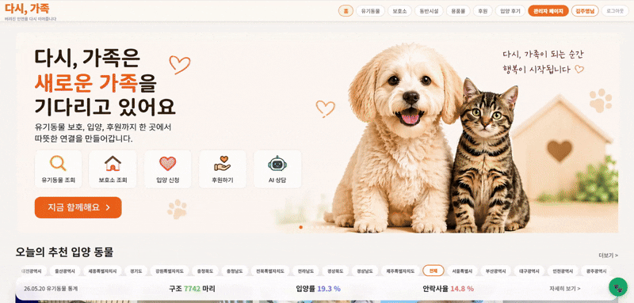

<div align="center">

# 다시, 가족

### 공공데이터 기반 유기동물 조회 · 입양 신청 · 후원 · AI 상담 · 관리자 운영 플랫폼


<br />



</div>

---

## 프로젝트 소개

`다시, 가족`은 공공데이터포털의 유기동물 데이터를 기반으로 보호 동물 조회, 보호소 탐색, 입양 신청, 후원, 입양 후기, AI 상담, 관리자 운영을 하나의 흐름으로 연결한 풀스택 프로젝트입니다.

단순 목록 조회를 넘어 실제 서비스 운영에 필요한 데이터 수집, 인증/권한, 이미지 업로드 검증, 관리자 대시보드, 결제 준비 구조, AI 소개/상담 기능까지 구현했습니다.

---

## 포트폴리오 포인트

| 영역 | 구현 내용 |
| --- | --- |
| 데이터 수집 | 공공 API 데이터를 배치로 수집하고 DB 스냅샷 기반으로 조회 |
| 사용자 기능 | 유기동물 조회, 상세 정보, 관심 동물, 입양 신청, 후기 작성 |
| 보호소 탐색 | 지역별 보호소 검색, 보호소 목록, 지도 연동, 보호 동물 조회 |
| 인증/보안 | 세션 로그인, Spring Security, CSRF, 관리자 권한 분리 |
| 후원/결제 | 후원 캠페인, 후원자 등급, PortOne 결제 준비/검증 구조 |
| AI 기능 | OpenRouter 기반 유기동물 소개글 생성, 입양 상담 챗봇 |
| 운영 기능 | 관리자 대시보드, 입양/후원/회원/캠페인/배치 관리 |

---

## Preview

| 보호소 지도 탐색 | 유기동물 상세 / AI 소개 |
| --- | --- |
|  |  |

---

## 주요 기능

### 사용자

- 유기동물 목록/상세 조회
- 지역별 추천 동물 및 통계 조회
- 보호소 목록, 지도 기반 위치 확인
- 관심 동물 저장 및 관리
- 입양 신청 작성과 신청 내역 조회
- 후원 캠페인 조회 및 후원 흐름
- 입양 후기 작성, 이미지 업로드, 좋아요
- AI 유기동물 소개글 및 입양 상담 챗봇

### 관리자

- 관리자 대시보드와 운영 모니터링
- 입양 신청 승인/거절 관리
- 후원/결제 내역 관리
- 후원 캠페인 등록/수정/삭제
- 회원 정보 및 권한 관리
- 공공 API 배치 수집 실행과 히스토리 확인

---

## 기술 스택

### Backend

- Java 21
- Spring Boot 3.5.6
- Spring MVC, Spring Data JPA, Hibernate
- Spring Security, Session Auth, CSRF
- Spring Scheduler, Spring Validation
- MySQL 8, H2
- JUnit 5, MockMvc, Mockito

### Frontend

- React 18
- Vite
- React Router
- JavaScript
- CSS
- Recharts
- Fetch API

### External API / Integration

- data.go.kr 공공데이터포털 API
- OpenRouter AI API
- PortOne 결제 API
- SMTP Mail
- Local File Storage / AWS S3 선택 지원

---

## 아키텍처

```text
React + Vite
    |
    | HTTP / Session Cookie
    v
Spring Boot API
    |
    |-- Spring Security / Session Auth / CSRF
    |-- JPA / MySQL
    |-- Scheduler / Batch Log
    |
    |--> data.go.kr Public API
    |      배치 수집 -> AnimalSnapshot 저장
    |
    |--> OpenRouter AI
    |      동물 소개글 / 입양 상담 챗봇
    |
    |--> PortOne
    |      결제 준비 / 결제 검증 구조
    |
    |--> Local Storage or AWS S3
           후기/캠페인 이미지 저장
```

---

## 프로젝트 구조

```text
animal-platform
├─ demo                         # Spring Boot 백엔드
│  ├─ src/main/java/com/animalplatform
│  ├─ src/main/resources
│  └─ pom.xml
├─ frontend                     # React + Vite 프론트엔드
│  ├─ src/pages
│  ├─ src/components
│  ├─ src/lib
│  └─ package.json
├─ docs/images                  # README 이미지
└─ README.md
```

---

## 빠른 실행

### 1. 환경변수 준비

루트 또는 백엔드 실행 환경에 `.env`를 준비합니다.

```env
DB_URL=jdbc:mysql://localhost:3306/again_family?serverTimezone=Asia/Seoul&characterEncoding=UTF-8&useUnicode=true&allowPublicKeyRetrieval=true&useSSL=false
DB_USERNAME=root
DB_PASSWORD=your_password
PUBLIC_API_KEY=your_data_go_kr_key
OPENROUTER_API_KEY=your_openrouter_key
VITE_API_BASE_URL=http://localhost:8080
```

### 2. MySQL DB 생성

```sql
CREATE DATABASE again_family CHARACTER SET utf8mb4 COLLATE utf8mb4_unicode_ci;
```

### 3. 백엔드 실행

```powershell
cd demo
$env:JAVA_HOME='C:\ww\ww\jdk21\jdk-21.0.10+7'
$env:Path="$env:JAVA_HOME\bin;$env:Path"
.\mvnw.cmd spring-boot:run "-Dspring-boot.run.profiles=local,mysql,oauth"
```

### 4. 프론트엔드 실행

```powershell
cd frontend
npm install
npm run dev
```

```text
Frontend: http://localhost:5173
Backend:  http://localhost:8080
Swagger:  http://localhost:8080/swagger-ui.html
```

---

## 데모 계정

로컬 실행 시 `DataInitializer`를 통해 기본 계정을 사용할 수 있습니다.

| 역할 | 이메일 | 비밀번호 |
| --- | --- | --- |
| 관리자 | `admin@dasigajok.com` | `admin1234` |
| 일반 사용자 | `user@dasigajok.com` | `user1234` |

---

## 주요 API

| Method | Path | 설명 |
| --- | --- | --- |
| `GET` | `/api/animals` | 유기동물 목록 조회 |
| `GET` | `/api/animals/{animalSlug}` | 유기동물 상세 조회 |
| `GET` | `/api/animals/{desertionNo}/summary` | AI 소개글 조회/생성 |
| `GET` | `/api/shelters` | 보호소 목록 조회 |
| `GET` | `/api/shelters/{careRegNo}` | 보호소 상세 조회 |
| `POST` | `/api/adoptions` | 입양 신청 |
| `GET` | `/api/favorites` | 관심 동물 목록 |
| `POST` | `/api/payments/prepare` | 결제 준비 |
| `POST` | `/api/payments/confirm` | 결제 검증 |
| `POST` | `/api/chat` | AI 입양 상담 |
| `GET` | `/api/admin/monitor` | 관리자 모니터링 |
| `POST` | `/api/admin/batch/run` | 수동 배치 실행 |

전체 API는 로컬 실행 후 Swagger에서 확인할 수 있습니다.

```text
http://localhost:8080/swagger-ui.html
```

---

## 트러블슈팅

### `Unknown database 'again_family'`

MySQL에 DB가 없을 때 발생합니다.

```sql
CREATE DATABASE again_family CHARACTER SET utf8mb4 COLLATE utf8mb4_unicode_ci;
```

### 프론트에서 백엔드 호출 실패

프론트 환경변수를 확인하고 개발 서버를 다시 시작합니다.

```env
VITE_API_BASE_URL=http://localhost:8080
```

### AI 소개/챗봇이 동작하지 않음

OpenRouter API 키가 필요합니다.

```env
OPENROUTER_API_KEY=sk-or-v1-...
```

---

## 검증 명령어

```powershell
# Backend
cd demo
.\mvnw.cmd test
```

```powershell
# Frontend
cd frontend
npm run build
```

---

## 발표용 요약

`다시, 가족`은 공공데이터 기반 유기동물 입양 플랫폼입니다. 유기동물 조회부터 보호소 지도 탐색, 입양 신청, 후원, 입양 후기, AI 상담, 관리자 운영까지 실제 서비스 흐름을 기준으로 구현했으며, Spring Boot와 React를 활용해 공공 API 배치 수집, DB 스냅샷 조회, 세션 인증, CSRF, 관리자 대시보드, 이미지 업로드 검증, AI 소개글 생성 기능을 구성했습니다.

---

## License

MIT License
