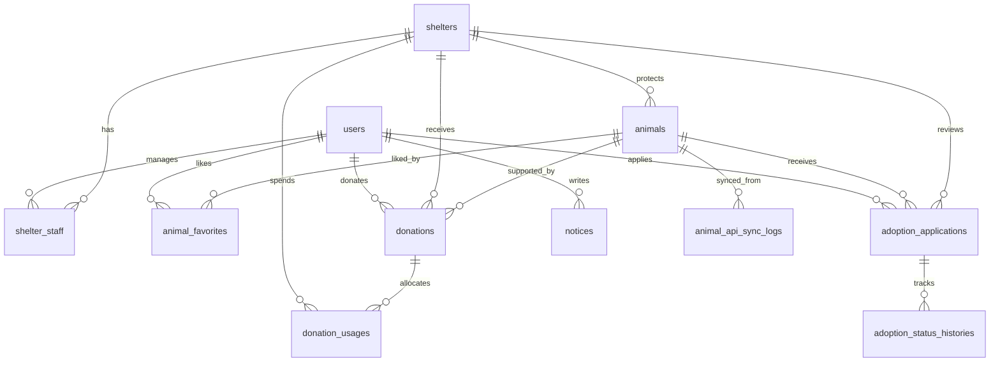

# ERD 초안

## 핵심 엔티티

- `users`: 회원, 보호소 담당자, 관리자 계정
- `shelters`: 보호소 기본 정보
- `shelter_staff`: 보호소와 담당자 계정 연결
- `animals`: 유기동물 기본 정보
- `animal_api_sync_logs`: 공공데이터 연동 이력
- `animal_favorites`: 관심 등록
- `adoption_applications`: 입양 신청
- `adoption_status_histories`: 입양 상태 변경 이력
- `donations`: 후원 내역
- `donation_usages`: 후원금 사용 내역
- `notices`: 공지사항
- `statistics_daily`: 일별 집계 통계

## 관계 요약

- 한 명의 `user`는 여러 건의 관심 등록, 입양 신청, 후원을 가질 수 있다.
- 한 개의 `shelter`는 여러 마리의 `animal`을 관리할 수 있다.
- 한 개의 `animal`은 여러 명의 회원에게 관심 등록될 수 있다.
- 한 개의 `animal`은 여러 건의 입양 신청을 받을 수 있다.
- 한 개의 `donation`은 특정 `animal` 또는 특정 `shelter`에 연결될 수 있다.
- 한 개의 `shelter`는 여러 건의 후원금 사용 내역을 등록할 수 있다.

## Mermaid ERD

## 테이블별 설계 포인트

### users

- 역할은 `MEMBER`, `SHELTER_MANAGER`, `ADMIN`
- 보호소 담당자는 계정 자체 role과 별개로 `shelter_staff` 매핑을 통해 실제 소속 보호소를 연결

### shelters

- 공공데이터 보호소 정보와 내부 운영 정보를 함께 가질 수 있도록 `external_shelter_code` 분리
- 승인 상태를 둬서 관리자 검수 후 노출 가능

### animals

- 공공 API 원본 필드와 서비스 내부 상태를 분리
- `api_status_raw`는 원본 상태 저장
- `service_status`는 내부 운영 상태

### adoption_applications

- 신청 당시의 회원 메시지와 검토 상태 저장
- 상태 이력은 별도 테이블에 누적

### donations

- `donation_target_type`으로 `ANIMAL` 또는 `SHELTER` 구분
- 결제 상태는 `READY`, `PAID`, `FAILED`, `CANCELED`

### statistics_daily

- 관리자 대시보드용 일 단위 스냅샷
- 조회 성능과 차트 단순화를 위해 집계 테이블로 운영
